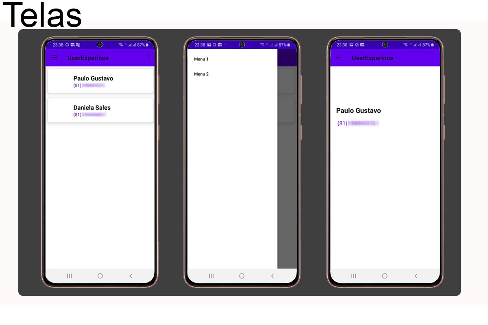

# UserExperience App com Kotlin 

OLA"  bem vindo 

Este foi um dos módulos do BootCAmp da  Everis na DIO.

Este app foi desenvolvido como exercício para desenvolvimentos de alguns elementos de UI. 

Fiquem a vontade para olhar estou aberto  a dicas e sugestões.

